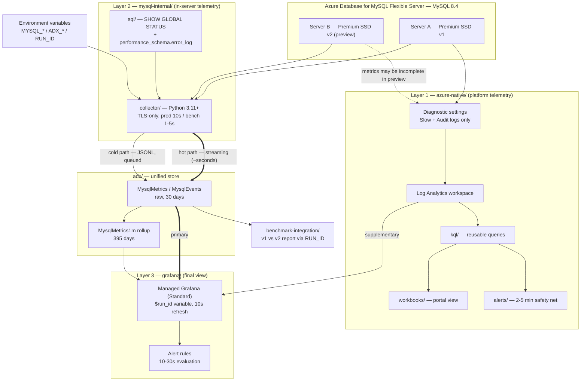

# azure-mysql-monitoring

Monitoring for **Azure Database for MySQL Flexible Server (MySQL 8.4)**.

The same repository serves two purposes:

1. **Benchmark runs** — measuring and comparing **Premium SSD v1 vs Premium SSD v2** storage.
2. **Ongoing production monitoring** for gaming customers.

> Project rules live in [`.github/copilot-instructions.md`](.github/copilot-instructions.md).
> Read them before contributing or prompting Copilot in this repo.

## Architecture overview



### Why two collection layers

| | Layer 1 — `azure-native/` | Layer 2 — `mysql-internal/` |
|---|---|---|
| Source | Azure Monitor, diagnostic settings, Log Analytics | Direct MySQL connection |
| Tooling | Bicep, KQL, Workbooks, alert rules | Python collector, plain SQL |
| Logs available | Slow + Audit only | **Error log** (via `performance_schema.error_log`) |
| Latency | 2–5 minutes | Seconds |
| Benchmark role | Supplementary | **Primary** |

**Premium SSD v2 servers are in preview**, so Azure platform metrics and diagnostic logs may be
incomplete for them. During benchmark runs, Layer 2 is the authoritative data source.

Flexible Server exposes only two resource log categories — `MySQL Audit Logs` and `MySQL Slow Logs`
— and **no error-log category**. Layer 2 is the only way to get error-log data.

### Storage — Azure Data Explorer

[`adx/`](adx/) is the **single unified store** for both numeric metrics and text log events, with
two ingestion paths writing to the same tables:

| Path | Latency | Used for |
|---|---|---|
| Streaming ingestion (hot) | seconds | Live production monitoring and alerting |
| Queued ingestion (cold) | batching window | JSONL replay, backfill, benchmark archives |

Retention is tiered — raw tables expire in 30 days while materialized rollups are kept for
395 days — so growing log volume does not grow cost linearly.

### Layer 3 — Grafana is the final view

[`grafana/`](grafana/) runs on **Azure Managed Grafana (Standard tier)** and renders ADX and Azure
Monitor on one time axis. It collects and stores nothing.

- Both data sources use **managed identity** and are **read-only** — no secrets exist.
- **`$run_id`** is a template variable, so a Premium SSD v1 run and a v2 run can be compared
  without editing panels.
- Grafana never connects to MySQL directly; a live `SHOW GLOBAL STATUS` is a snapshot with no time
  axis.

### Real-time budget

| Stage | Contribution |
|---|---|
| Collector poll interval (10s) | ~5s average |
| ADX streaming ingestion | ~5s |
| Grafana alert evaluation (30s) | ~15s |
| **End-to-end detection** | **~25–45s** |

Azure Monitor platform alerts land in the 2–5 minute range, so the fast path is Layer 2 → ADX →
Grafana. Layer 1 alerting remains as an independent safety net that still works if the collector
dies — and a **`collector_heartbeat`** rule fires when collector data simply stops, since a
flatlined chart otherwise reads as healthy.

## Repository layout

| Path | Purpose |
|---|---|
| [`azure-native/`](azure-native/) | Azure Monitor–based monitoring (Layer 1) |
| [`azure-native/bicep/`](azure-native/bicep/) | Bicep IaC for workspace, diagnostic settings, alerts |
| [`azure-native/workbooks/`](azure-native/workbooks/) | Azure Workbook dashboard definitions |
| [`azure-native/kql/`](azure-native/kql/) | Reusable KQL queries |
| [`azure-native/alerts/`](azure-native/alerts/) | Alert rules and thresholds |
| [`mysql-internal/`](mysql-internal/) | In-server telemetry (Layer 2) |
| [`mysql-internal/collector/`](mysql-internal/collector/) | Python collector |
| [`mysql-internal/sql/`](mysql-internal/sql/) | `SHOW GLOBAL STATUS` / `performance_schema` queries |
| [`adx/`](adx/) | **Unified store** for metrics and log events |
| [`adx/bicep/`](adx/bicep/) | Cluster, database, identities and role assignments |
| [`adx/tables/`](adx/tables/) | Table DDL, ingestion mappings, materialized views |
| [`adx/policies/`](adx/policies/) | Streaming, batching, retention and caching policies |
| [`grafana/`](grafana/) | Final monitoring view (Layer 3) |
| [`grafana/dashboards/`](grafana/dashboards/) | Dashboard JSON models |
| [`grafana/datasources/`](grafana/datasources/) | ADX + Azure Monitor data source provisioning |
| [`grafana/provisioning/`](grafana/provisioning/) | Providers, folders, deployment wiring |
| [`benchmark-integration/`](benchmark-integration/) | Joins benchmark output with collector metrics |
| [`testing/`](testing/) | Real-Azure test environment and end-to-end verification |

## Verifying it works

The pipeline is verifiable against real Azure resources — there is no emulator path, because
the things most likely to be wrong (enforced TLS, diagnostic log categories, streaming
ingestion latency, managed-identity permissions) only exist on the real platform.

```powershell
cd testing
./scripts/deploy.ps1 -ResourceGroup mysql-mon-test   # MySQL 8.4 + LAW + ADX + Grafana
. ./scripts/load-env.ps1
python scripts/bootstrap_adx.py                      # apply the committed .kql schema
python scripts/workload.py --seconds 300             # in a second shell
python ../mysql-internal/collector/collector.py --interval 5 --sink jsonl --sink adx-streaming --max-cycles 40
python verify.py
./scripts/teardown.ps1 -ResourceGroup mysql-mon-test
```

`verify.py` asserts behaviour rather than deployment success, and states what each failure
would mean. See [`testing/README.md`](testing/README.md).

## MySQL 8.4 notes

- `caching_sha2_password` is the default authentication plugin; `mysql_native_password` is
  **disabled by default**. Clients and drivers must support `caching_sha2_password`.
- `innodb_redo_log_capacity` replaces `innodb_log_file_size` — use the new variable everywhere.
- Azure enforces `require_secure_transport=ON`, so **every client must connect over TLS**.

## Configuration

Nothing is hardcoded. All connection information is supplied via environment variables:

| Variable | Description |
|---|---|
| `MYSQL_HOST` | Flexible Server FQDN, e.g. `<name>.mysql.database.azure.com` |
| `MYSQL_USER` | MySQL user with `PROCESS` / `SELECT` on `performance_schema` |
| `MYSQL_PASSWORD` | Password (never logged, never committed) |
| `MYSQL_DB` | Default database/schema |
| `MYSQL_TIER` | `premium-ssd-v1` / `premium-ssd-v2`, stamped on every row |
| `RUN_ID` | Identifier tagged onto every row, used to join benchmark and collector data |
| `ADX_CLUSTER_URI` | `https://<cluster>.<region>.kusto.windows.net` |
| `ADX_INGEST_URI` | `https://ingest-<cluster>.<region>.kusto.windows.net` |
| `ADX_DATABASE` | Database holding `MysqlMetrics` / `MysqlEvents` |

Azure services authenticate with **managed identity**, so ADX and Azure Monitor need no secret at
all. `MYSQL_PASSWORD` is the only credential in the system.

```bash
export MYSQL_HOST="<server>.mysql.database.azure.com"
export MYSQL_USER="<user>"
export MYSQL_PASSWORD="<password>"
export MYSQL_DB="<database>"
export MYSQL_TIER="premium-ssd-v2"
export RUN_ID="ssdv2-2026-08-10-01"
```

On PowerShell:

```powershell
$env:MYSQL_HOST = "<server>.mysql.database.azure.com"
$env:MYSQL_USER = "<user>"
$env:MYSQL_PASSWORD = "<password>"
$env:MYSQL_DB     = "<database>"
$env:MYSQL_TIER   = "premium-ssd-v2"
$env:RUN_ID       = "ssdv2-2026-08-10-01"
```

## Conventions

- **Python 3.11+**, core dependencies limited to `mysql-connector-python` (or `PyMySQL`). The ADX
  sink is the single sanctioned extra, isolated in `requirements-adx.txt`. **No ORM.**
- **All timestamps are UTC ISO-8601.** Kusto `datetime` is always UTC, so a naive or local timestamp
  silently shifts every dashboard.
- **Every row carries `RUN_ID`** so benchmark results and collector output can be joined on the time
  axis; production rows use a sentinel such as `prod`.
- Credentials are never hardcoded — see the table above.
