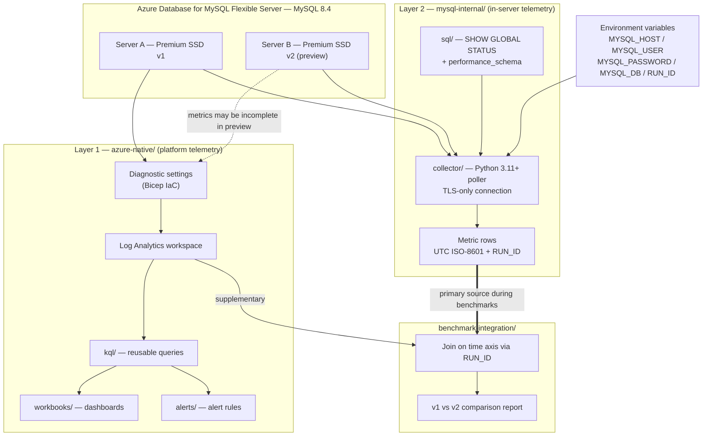

# azure-mysql-monitoring

Monitoring for **Azure Database for MySQL Flexible Server (MySQL 8.4)**.

The same repository serves two purposes:

1. **Benchmark runs** — measuring and comparing **Premium SSD v1 vs Premium SSD v2** storage.
2. **Ongoing production monitoring** for gaming customers.

> Project rules live in [`.github/copilot-instructions.md`](.github/copilot-instructions.md).
> Read them before contributing or prompting Copilot in this repo.

## Architecture overview



### Why two layers

| | Layer 1 — `azure-native/` | Layer 2 — `mysql-internal/` |
|---|---|---|
| Source | Azure Monitor, diagnostic settings, Log Analytics | Direct MySQL connection |
| Tooling | Bicep, KQL, Workbooks, alert rules | Python collector, plain SQL |
| Strength | Platform-level view, alerting, long retention | High-resolution engine internals |
| Benchmark role | Supplementary | **Primary** |

**Premium SSD v2 servers are in preview**, so Azure platform metrics and diagnostic logs may be
incomplete for them. During benchmark runs, Layer 2 is the authoritative data source.

## Repository layout

| Path | Purpose |
|---|---|
| [`azure-native/`](azure-native/) | Azure Monitor–based monitoring (Layer 1) |
| [`azure-native/bicep/`](azure-native/bicep/) | Bicep IaC for workspace, diagnostic settings, alerts |
| [`azure-native/workbooks/`](azure-native/workbooks/) | Azure Workbook dashboard definitions |
| [`azure-native/kql/`](azure-native/kql/) | Reusable KQL queries |
| [`azure-native/alerts/`](azure-native/alerts/) | Alert rules and thresholds |
| [`mysql-internal/`](mysql-internal/) | In-server telemetry (Layer 2) |
| [`mysql-internal/collector/`](mysql-internal/collector/) | Python collector |
| [`mysql-internal/sql/`](mysql-internal/sql/) | `SHOW GLOBAL STATUS` / `performance_schema` queries |
| [`benchmark-integration/`](benchmark-integration/) | Joins benchmark output with collector metrics |

## MySQL 8.4 notes

- `caching_sha2_password` is the default authentication plugin; `mysql_native_password` is
  **disabled by default**. Clients and drivers must support `caching_sha2_password`.
- `innodb_redo_log_capacity` replaces `innodb_log_file_size` — use the new variable everywhere.
- Azure enforces `require_secure_transport=ON`, so **every client must connect over TLS**.

## Configuration

Nothing is hardcoded. All connection information is supplied via environment variables:

| Variable | Description |
|---|---|
| `MYSQL_HOST` | Flexible Server FQDN, e.g. `<name>.mysql.database.azure.com` |
| `MYSQL_USER` | MySQL user with `PROCESS` / `SELECT` on `performance_schema` |
| `MYSQL_PASSWORD` | Password (never logged, never committed) |
| `MYSQL_DB` | Default database/schema |
| `RUN_ID` | Identifier tagged onto every metric row, used to join benchmark and collector data |

```bash
export MYSQL_HOST="<server>.mysql.database.azure.com"
export MYSQL_USER="<user>"
export MYSQL_PASSWORD="<password>"
export MYSQL_DB="<database>"
export RUN_ID="ssdv2-2026-08-10-01"
```

On PowerShell:

```powershell
$env:MYSQL_HOST = "<server>.mysql.database.azure.com"
$env:MYSQL_USER = "<user>"
$env:MYSQL_PASSWORD = "<password>"
$env:MYSQL_DB     = "<database>"
$env:RUN_ID       = "ssdv2-2026-08-10-01"
```

## Conventions

- **Python 3.11+**, dependencies limited to `mysql-connector-python` (or `PyMySQL`). **No ORM.**
- **All timestamps are UTC ISO-8601.**
- **Every metric row carries `RUN_ID`** so benchmark results and collector output can be joined
  on the time axis.
- Credentials are never hardcoded — see the table above.
