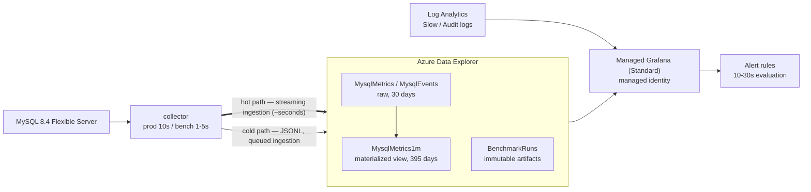

# adx/ — Azure Data Explorer: the unified store

**Azure Data Explorer (ADX) is the single storage backend for this project.** Both numeric metrics
and text log events from [`../mysql-internal/`](../mysql-internal/) land here, and
[`../grafana/`](../grafana/) reads it as its primary data source.

ADX was chosen over plain files or a MySQL table because it is the only option that holds
**metrics and logs together**, compresses columnar data well enough for long production retention,
supports **near-real-time streaming ingestion**, and reuses the **KQL** the team already writes for
[`../azure-native/`](../azure-native/).

## What lives here

| Directory | Purpose |
|---|---|
| [`bicep/`](bicep/) | Cluster, database, streaming-ingestion config, role assignments |
| [`tables/`](tables/) | Table DDL, ingestion mappings, update policies, materialized views |
| [`policies/`](policies/) | Retention, caching, batching, streaming-ingestion policies |

## Architecture

## Two ingestion paths, one store

Both paths write to the **same tables**, so queries never need to know which path delivered a row.

| Path | Latency | Used for |
|---|---|---|
| **Streaming ingestion** (hot) | seconds | Live production monitoring and alerting |
| **Queued ingestion** (cold) | batching window | Bulk JSONL replay, benchmark archives, backfill |

Queued ingestion batches by default up to **5 minutes**, which is far too slow for real-time
monitoring — this is exactly why the hot path exists. Do not try to make real-time work by only
shrinking the batching policy; enable streaming ingestion. See [`policies/`](policies/).

Streaming ingestion has a **~4 MB per-request limit**, so large backfills must use the queued path.

## Detection latency budget

| Stage | Contribution |
|---|---|
| Collector poll interval (10s) | ~5s average |
| Streaming ingestion | ~5s |
| Grafana alert evaluation (30s) | ~15s |
| **Total** | **~25–45s** |

For comparison, Azure Monitor platform metric alerts land in the 2–5 minute range. **The real-time
path is Layer 2 → ADX → Grafana, not Layer 1.** Layer 1 alerting remains as the slower, independent
safety net that keeps working even if the collector dies.

## Retention tiers

Raw data is kept briefly and rollups are kept long, so growing log volume does not grow cost
linearly. See [`policies/`](policies/) for the actual policy commands.

| Table | Hot cache | Retention | Purpose |
|---|---|---|---|
| `MysqlMetrics` | 7 days | 30 days | Real-time and recent analysis |
| `MysqlMetrics1m` (materialized view) | 30 days | 395 days | Long-term trends |
| `MysqlEvents` | 30 days | 90–365 days | `performance_schema.error_log` entries |
| `BenchmarkRuns` | 30 days | unlimited | Immutable benchmark artifacts |

## Time and correlation

- Kusto `datetime` is **always UTC**, which matches this repo's UTC ISO-8601 rule exactly. Never
  ingest a local-time or naive timestamp.
- Every row carries **`RunId`** (from the `RUN_ID` environment variable), so benchmark results and
  collector telemetry join on the time axis, and Grafana's `$run_id` variable can isolate one run.

## Access and security

- **No credentials in this repo.** The collector authenticates with a **managed identity** (or a
  workload identity in CI); Managed Grafana uses **its own managed identity** granted the
  `Viewer` role on the ADX database.
- The Grafana identity gets **read-only** access. The collector identity gets ingest-only.
- Cluster/database names come from environment variables or Bicep parameters, never hardcoded.

| Variable | Description |
|---|---|
| `ADX_CLUSTER_URI` | e.g. `https://<cluster>.<region>.kusto.windows.net` |
| `ADX_INGEST_URI` | e.g. `https://ingest-<cluster>.<region>.kusto.windows.net` |
| `ADX_DATABASE` | Target database name |
| `RUN_ID` | Benchmark run identifier stamped on every row |

## Scale-out note: Event Hub

`collector → Event Hub → ADX` is the textbook pattern for buffering and replay, but it is
**deliberately not used here**. At a scale of tens of servers it adds cost and moving parts for no
benefit. Introduce it when fan-in grows large (hundreds of collectors, multiple regions) or when
you need to survive an ADX outage without losing data — at that point only the collector's sink
implementation changes, not the table schema or the dashboards.
