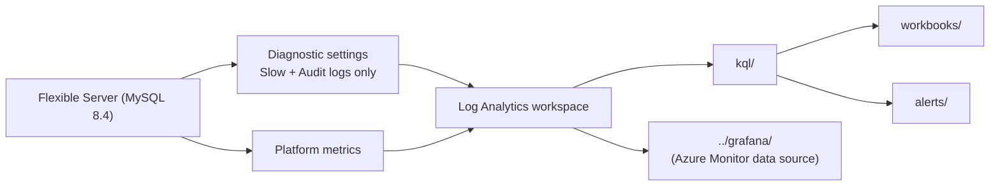

# azure-native/ — Layer 1: Azure platform monitoring

Monitoring built from **Azure Monitor** telemetry for Azure Database for MySQL Flexible Server
(MySQL 8.4).

## What lives here

| Directory | Purpose |
|---|---|
| [`bicep/`](bicep/) | Bicep IaC: Log Analytics workspace, diagnostic settings, alert rules |
| [`workbooks/`](workbooks/) | Azure Workbook JSON dashboard definitions |
| [`kql/`](kql/) | Reusable KQL queries against Log Analytics |
| [`alerts/`](alerts/) | Alert rule definitions and thresholds |

## Data flow

## Scope and limitations

- All Azure resources are provisioned with **Bicep** — no portal click-ops and no hand-written
  ARM JSON.
- **Premium SSD v2 is in preview.** Platform metrics and diagnostic categories may be incomplete
  or missing for v2-backed servers. For benchmark runs, treat `mysql-internal/` as the primary
  data source and use this layer as supplementary context.
- **This layer is the slow safety net, not the real-time view.** Platform metrics and diagnostic
  logs typically land in Log Analytics 2–5 minutes after the fact. Second-level detection is the
  job of Layer 2 streaming into [`../adx/`](../adx/).
- **There is no error-log diagnostic category.** Flexible Server exposes only `MySQL Audit Logs`
  and `MySQL Slow Logs`, both landing in the `AzureDiagnostics` table. MySQL error-log content is
  reachable only through `performance_schema.error_log` in Layer 2.

## What this layer is uniquely good for

Layer 2 cannot see any of these, so this layer is not optional:

| Signal | Why only Azure Monitor has it |
|---|---|
| Host CPU / memory / storage IOPS | Hypervisor-level, invisible from inside MySQL |
| Storage throttling and burst credits | Premium SSD v1/v2 tier behaviour |
| Failover, restart, maintenance events | Control-plane, via `AzureActivity` |
| Collector-down backstop | Survives when the self-built collector dies |

## Configuration

This layer targets Azure resources and does not connect to MySQL directly. Where any tooling here
does need database access, it reads the standard environment variables — nothing is hardcoded:

| Variable | Description |
|---|---|
| `MYSQL_HOST` | Flexible Server FQDN |
| `MYSQL_USER` | MySQL user |
| `MYSQL_PASSWORD` | Password (never logged, never committed) |
| `MYSQL_DB` | Default database/schema |
| `RUN_ID` | Tag applied to every metric row for benchmark correlation |

Azure resource identifiers (subscription, resource group, server name, workspace name) are passed
as **Bicep parameters** or environment variables — never committed as defaults.

## Conventions

- Timestamps in queries and outputs are **UTC ISO-8601**.
- Where results are correlated with benchmark runs, carry `RUN_ID` through as a column.
- MySQL 8.4 only: reference `innodb_redo_log_capacity` (not `innodb_log_file_size`) and assume
  TLS is enforced (`require_secure_transport=ON`).
