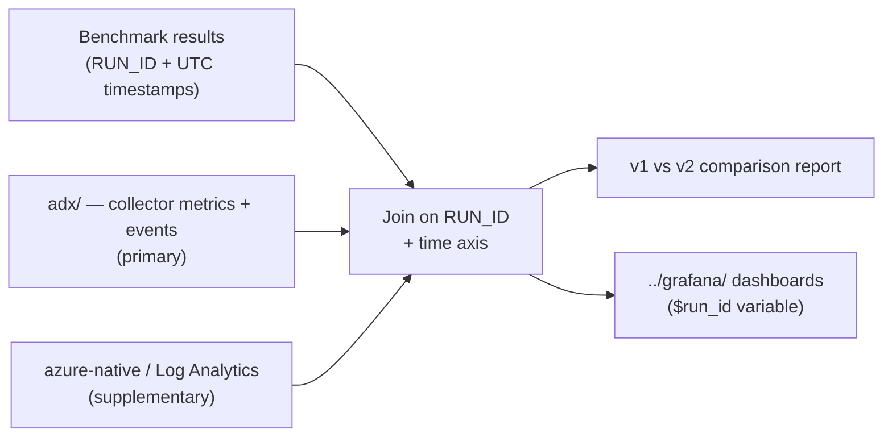

# benchmark-integration/

Glue between **benchmark runs** and **monitoring data**. This is where a Premium SSD v1 vs
Premium SSD v2 comparison is actually produced.

## Purpose

A benchmark tool (sysbench, an application-level load generator, etc.) produces throughput and
latency results. Separately, the collector in [`../mysql-internal/collector/`](../mysql-internal/collector/)
produces engine-internal metrics, and [`../azure-native/`](../azure-native/) produces platform
telemetry. This directory **joins them on the time axis using `RUN_ID`** and renders the comparison.



## Expected contents

| Path | Purpose |
|---|---|
| `runs/` | Per-run raw JSONL, one file per `RUN_ID` (git-ignored) |
| `upload.py` | Queued-ingests a finished run's JSONL into ADX |
| `join.py` | Aligns benchmark rows and collector rows on `run_id` + timestamp |
| `compare.py` | Produces the Premium SSD v1 vs v2 comparison |
| `report/` | Generated summaries and charts |

## Why the collector is the primary source

**Premium SSD v2 servers are in preview**, so Azure Monitor metrics and diagnostic logs may be
incomplete for them. Comparisons are therefore built from `mysql-internal/` collector data stored in
[`../adx/`](../adx/), with `azure-native/` used as supplementary context. Any disagreement between
the two layers is recorded in the report rather than silently resolved.

## Benchmark runs use the cold path

A benchmark run writes JSONL locally at high resolution (1–5s), then uploads it to ADX through
**queued ingestion**. Streaming ingestion is for live production monitoring and is capped at roughly
4 MB per request, so it is the wrong tool for a bulk run archive.

Keeping the local JSONL is deliberate: it is the immutable artifact that lets a run be re-ingested
or re-analysed after the fact, and it means the benchmark path needs no Azure dependencies at all.

## Run correlation contract

Both sides of the join must satisfy:

- **`RUN_ID`** — read from the `RUN_ID` environment variable and present on **every** row.
  A single benchmark execution uses one `RUN_ID` for the load generator and the collector.
- **UTC ISO-8601 timestamps** — timezone-aware, never local time. This is the join key alongside
  `RUN_ID`.
- A storage-tier label (`premium-ssd-v1` / `premium-ssd-v2`) so runs are attributable.

Suggested `RUN_ID` convention: `<tier>-<yyyy-mm-dd>-<seq>`, e.g. `ssdv2-2026-08-10-01`.

The same `RUN_ID` is what [`../grafana/`](../grafana/) exposes as the `$run_id` dashboard variable,
so a run analysed here can be opened in Grafana without any extra mapping.

## Configuration

Nothing is hardcoded. All connection info comes from environment variables:

| Variable | Description |
|---|---|
| `MYSQL_HOST` | Flexible Server FQDN |
| `MYSQL_USER` | MySQL user |
| `MYSQL_PASSWORD` | Password (never logged, never committed) |
| `MYSQL_DB` | Default database/schema |
| `MYSQL_TIER` | `premium-ssd-v1` / `premium-ssd-v2` |
| `RUN_ID` | Identifier shared by the benchmark and the collector for one run |
| `ADX_INGEST_URI` | ADX ingestion endpoint, for uploading a finished run |
| `ADX_DATABASE` | Target ADX database |

```bash
export RUN_ID="ssdv2-2026-08-10-01"
export MYSQL_TIER="premium-ssd-v2"

# 1. start the collector (separate shell) with the same RUN_ID, then run the benchmark
# 2. upload the run, then join and compare
python upload.py  --run-id "$RUN_ID"
python join.py    --run-id "$RUN_ID"
python compare.py --baseline ssdv1-2026-08-10-01 --candidate "$RUN_ID"
```

## Conventions

- **Python 3.11+**, core dependencies limited to `mysql-connector-python` (or `PyMySQL`). Only
  `upload.py` may use the ADX extras from `requirements-adx.txt`. **No ORM.**
- All timestamps stay **UTC ISO-8601** end to end; no timezone conversion during the join.
- Raw run data under `runs/` is not committed — it can be large and may contain customer-shaped
  workload details.
- Benchmark rows in ADX are retained indefinitely; they are immutable artifacts, unlike production
  telemetry which expires on the schedule in [`../adx/policies/`](../adx/policies/).
