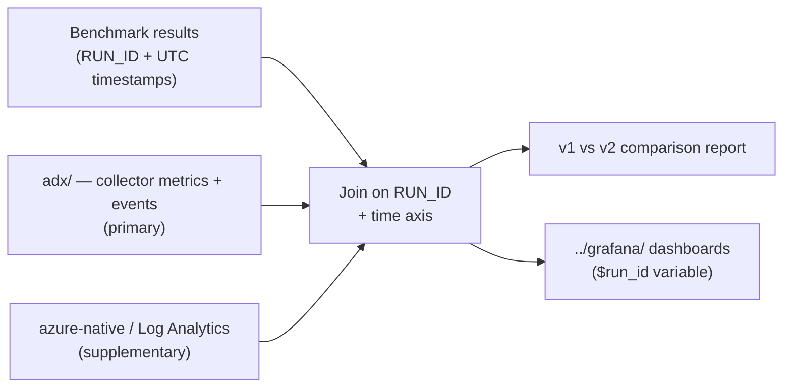

# benchmark-integration/

Glue between **benchmark runs** and **monitoring data**. This is where a Premium SSD v1 vs
Premium SSD v2 comparison is actually produced.

## Purpose

A benchmark tool (sysbench, an application-level load generator, etc.) produces throughput and
latency results. Separately, the collector in [`../mysql-internal/collector/`](../mysql-internal/collector/)
produces engine-internal metrics, and [`../azure-native/`](../azure-native/) produces platform
telemetry. This directory **joins them on the time axis using `RUN_ID`** and renders the comparison.



## Expected contents

| Path | Purpose |
|---|---|
| `runs/` | Per-run raw JSONL, one file per `RUN_ID` (git-ignored) |
| [`performance_report.py`](performance_report.py) | Generates a direction-aware Markdown comparison from ADX |
| [`PERFORMANCE_EVALUATION.md`](PERFORMANCE_EVALUATION.md) | Grafana analysis and reporting method |
| [`RESULTS.md`](RESULTS.md) | Preserved conclusion from the latest approved three-run comparison |
| [`deploy-pair.ps1`](deploy-pair.ps1) | Deploys matched MySQL 8.4 Premium SSD v1/v2 Targets in an explicit subscription |
| [`run-pair.ps1`](run-pair.ps1) | Runs both Targets concurrently for three repetitions and generates ADX reports |
| [`run-open-loop-pair.ps1`](run-open-loop-pair.ps1) | Runs fixed-rate read-heavy repetitions with a working set larger than a temporary reduced buffer pool |
| [`open_loop_workload.py`](open_loop_workload.py) | Prepares, runs and removes the deterministic open-loop dataset |
| [`upload_jsonl.py`](upload_jsonl.py) | Bulk-projects and uploads a completed JSONL archive to ADX |
| [`bicep/`](bicep/) | Ephemeral cross-subscription benchmark pair |
| `report/` | Generated summaries and charts |

## Why the collector is the primary source

**Premium SSD v2 servers are in preview**, so Azure Monitor metrics and diagnostic logs may be
incomplete for them. Comparisons are therefore built from `mysql-internal/` collector data stored in
[`../adx/`](../adx/), with `azure-native/` used as supplementary context. Any disagreement between
the two layers is recorded in the report rather than silently resolved.

## Benchmark runs use the cold path

A benchmark run writes JSONL locally at high resolution (1–5s), then uploads it to ADX through
**queued ingestion**. Streaming ingestion is for live production monitoring and is capped at roughly
4 MB per request, so it is the wrong tool for a bulk run archive.

Keeping the local JSONL is deliberate: it is the immutable artifact that lets a run be re-ingested
or re-analysed after the fact, and it means the benchmark path needs no Azure dependencies at all.

## Run correlation contract

Both sides of the join must satisfy:

- **`RUN_ID`** — read from the `RUN_ID` environment variable and present on **every** row.
  A single benchmark execution uses one `RUN_ID` for the load generator and the collector.
- **UTC ISO-8601 timestamps** — timezone-aware, never local time. This is the join key alongside
  `RUN_ID`.
- A storage-tier label (`premium-ssd-v1` / `premium-ssd-v2`) so runs are attributable.

Suggested `RUN_ID` convention: `<tier>-<yyyy-mm-dd>-<seq>`, e.g. `ssdv2-2026-08-10-01`.

The same `RUN_ID` is what [`../grafana/`](../grafana/) exposes as the `$run_id` dashboard variable,
so a run analysed here can be opened in Grafana without any extra mapping.

## Configuration

Nothing is hardcoded. All connection info comes from environment variables:

| Variable | Description |
|---|---|
| `MYSQL_HOST` | Flexible Server FQDN |
| `MYSQL_USER` | MySQL user |
| `MYSQL_PASSWORD` | Password (never logged, never committed) |
| `MYSQL_DB` | Default database/schema |
| `MYSQL_TIER` | `premium-ssd-v1` / `premium-ssd-v2` |
| `RUN_ID` | Identifier shared by the benchmark and the collector for one run |
| `ADX_INGEST_URI` | ADX ingestion endpoint, for uploading a finished run |
| `ADX_DATABASE` | Target ADX database |

```bash
export RUN_ID="ssdv2-2026-08-10-01"
export MYSQL_TIER="premium-ssd-v2"

# Start the collector with the same RUN_ID, run the workload, then compare:
python performance_report.py \
  --baseline-run ssdv1-2026-08-10-01 --baseline-target orders-v1 \
  --candidate-run "$RUN_ID" --candidate-target orders-v2
```

## Conventions

- **Python 3.11+**, core dependencies limited to `mysql-connector-python` (or `PyMySQL`). ADX
  reporting uses the sanctioned extras from `requirements-adx.txt`. **No ORM.**
- All timestamps stay **UTC ISO-8601** end to end; no timezone conversion during the join.
- Raw run data under `runs/` is not committed — it can be large and may contain customer-shaped
  workload details.
- All ADX telemetry, including benchmark rows, expires after exactly **90 days**. Preserve approved
  conclusions in a Markdown report; keep raw JSONL outside Git for replay.

See [`PERFORMANCE_EVALUATION.md`](PERFORMANCE_EVALUATION.md) for the complete workflow.

Premium SSD v2 currently requires v6 compute while Premium SSD v1 is rejected on v6. The deployment
therefore uses the closest 8-vCore/64-GiB pair: E8ds v5 for v1 and E8ds v6 for v2. Reports must
record this unavoidable CPU-generation confound and must not attribute every delta solely to storage.

`run-pair.ps1` generates a collision-resistant batch ID by default. For a named run, pass
`-BatchId storage-final-20260811`; the command fails rather than overwriting an existing batch or
reusing its ADX `RUN_ID` values.

For a fixed offered-rate comparison that produces physical reads, use:

```powershell
.\run-open-loop-pair.ps1 `
  -MonitoringSubscription '<monitoring-subscription-id>' `
  -BatchId storage-open-loop-20260811
```

The wrapper first verifies that the ADX query endpoint is available, then temporarily sets both
`innodb_buffer_pool_size` values to 1 GiB, creates identical 2 GiB datasets, and runs three 80%-read
repetitions at 500 operations/s. A changed buffer-pool configuration is followed by an explicit
server stop/start cycle so a delayed Azure service restart cannot interrupt dataset preparation or
the workload. Cleanup starts a stopped server when necessary, removes the datasets, and restores and
recycles the original buffer-pool configuration in `finally`. Workload JSON records scheduled,
completed, dropped, error and end-to-end p50/p95/p99 values for each Target.
