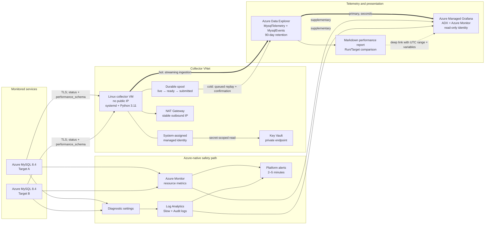
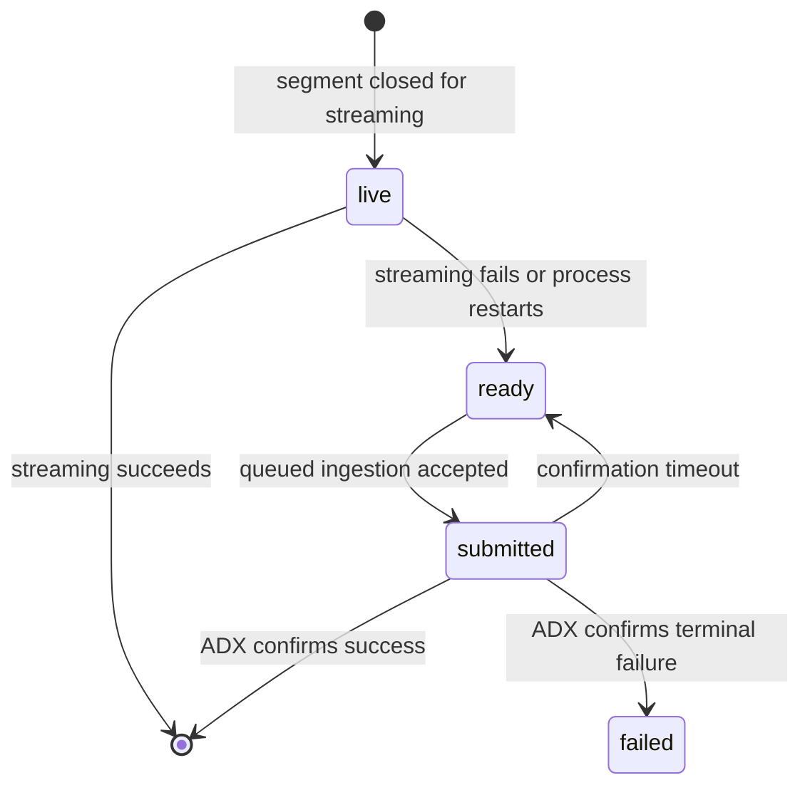

# Monitoring system architecture

This document describes the deployed architecture, trust boundaries, data paths and failure
behaviour for the Azure MySQL 8.4 monitoring system. The editable diagram source is
[`architecture.excalidraw`](architecture.excalidraw) and can be opened at
[Microsoft Excalidraw](https://aka.ms/excalidraw).

## System context

The system deliberately has two independent monitoring layers:

1. **Azure-native safety path** remains available when the collector is down. It supplies host-level
   resource metrics and the Slow/Audit log categories exposed by Flexible Server.
2. **MySQL-internal fast path** is the primary production and benchmark source. It supplies
   second-level MySQL counters, file IO, query digest, lock, table and error-log telemetry.

Azure platform coverage can be incomplete for Premium SSD v2 preview servers, so benchmark
conclusions use the internal path as authoritative and treat Azure Monitor as supporting evidence.

## Component responsibilities

| Component | Owns | Does not own |
|---|---|---|
| Azure MySQL 8.4 Targets | Workload and MySQL telemetry sources | Monitoring history |
| Target/Profile YAML | Target identities, collection groups and cadences | Literal credentials |
| Collector VM | Polling, normalization, rate-safe cursor state and ingestion | Dashboard queries |
| Key Vault | Per-Target passwords | Broad collector configuration |
| Durable spool | Bounded outage buffering and idempotent replay | Long-term retention |
| ADX | Unified metric/event history, projections and KQL functions | Operator UI |
| Azure Monitor + Log Analytics | Platform metrics and Slow/Audit logs | MySQL error log |
| Managed Grafana | Read-only dashboards and alert evaluation | Collection or storage |
| Performance reporter | Reproducible Run/Target comparison and decision record | Raw benchmark load |

## Internal telemetry path

1. The Collection Plan schedules independent groups. Low-cost global status can run every 10
   seconds while high-cardinality statement, schema and table groups run less frequently.
2. The collector connects to every Target with TLS. MySQL 8.4 uses
   `caching_sha2_password`; `mysql_native_password` is not assumed.
3. Rows are normalized to the Telemetry Point contract and tagged with UTC timestamp, `RUN_ID`,
   Target, tier and collector identity.
4. Streaming ingestion writes the hot path to ADX for low-latency dashboards and alerts.
5. ADX projects packed telemetry into dashboard-friendly series. Counter rates are reset-safe and
   file latency is operation-weighted.
6. Every ADX table, projection and rollup expires after exactly 90 days.

### Outage and restart behaviour

Replay uses a content-derived `ingest-by` tag and `ingest-if-not-exists`, so resubmission after an
ambiguous timeout does not intentionally duplicate a segment. Spool capacity is bounded by
configuration; a full spool is an operational incident, not permission to consume the VM disk
without limit. The `collector_heartbeat` alert detects the otherwise ambiguous case where every
chart becomes flat because collection stopped.

## Azure-native telemetry path

Azure Monitor resource metrics are queried directly through Grafana's Azure Monitor data source.
Diagnostic settings route the Flexible Server `MySQL Slow Logs` and `MySQL Audit Logs` categories to
Log Analytics. Platform alerts form the slower independent safety net.

Flexible Server does not expose an Azure diagnostic category for its error log. The collector reads
`performance_schema.error_log` and writes those events to ADX.

## Identity and network boundaries

| Boundary | Control |
|---|---|
| MySQL connection | TLS is mandatory; production secrets are resolved from Key Vault |
| Collector ingress | VM has no public IP and requires approved private/admin access |
| Collector egress | NAT Gateway supplies a stable allow-listable source IP |
| Key Vault | Public access disabled; private endpoint/DNS; collector reads named secrets only |
| ADX write | Collector managed identity receives database Ingestor, not query administration |
| Grafana read | Managed identity receives read-only ADX/Azure Monitor access |
| Report generation | Developer/automation uses `DefaultAzureCredential`; no credentials in files |

Grafana never connects directly to MySQL. This avoids placing database credentials in the
presentation layer and guarantees that charts query time-series history rather than live snapshots.

## Dashboard and reporting flow

Managed Grafana is the final operational view:

- **Production Overview** answers whether the service is healthy.
- **Query Performance** finds expensive and tail-latency statement digests.
- **Storage IO** explains read/write pressure and operation-weighted file latency.
- **Benchmark — Premium SSD v1 vs v2** compares explicit baseline and candidate Run/Target pairs.

[`../benchmark-integration/performance_report.py`](../benchmark-integration/performance_report.py)
queries the same ADX `BenchmarkSummary` function as the benchmark dashboard. It writes a Markdown
decision record with data-quality gates and a Grafana deep link that preserves all four variables
and the UTC range. See
[`../benchmark-integration/PERFORMANCE_EVALUATION.md`](../benchmark-integration/PERFORMANCE_EVALUATION.md).

## Availability and limits

- The collector deployment is currently a **single VM**. Durable spool and restart recovery protect
  data during transient failures, but they do not provide collector high availability.
- The Azure-native path remains independent during collector failure.
- High-cardinality collection is bounded and opt-in; this is monitoring, not unrestricted query
  tracing.
- ADX is the only telemetry history. Grafana stores no measurements.
- The accepted retention boundary is 90 days. Approved benchmark conclusions must be preserved as
  reports before source telemetry expires.

## Repository mapping

| Architecture area | Repository path |
|---|---|
| Azure-native path | [`../azure-native/`](../azure-native/) |
| Collection Plan and runtime | [`../mysql-internal/collector/`](../mysql-internal/collector/) |
| Collector VM and operations | [`../mysql-internal/deployment/`](../mysql-internal/deployment/) |
| MySQL queries | [`../mysql-internal/sql/`](../mysql-internal/sql/) |
| ADX schema, policies and functions | [`../adx/`](../adx/) |
| Grafana data sources and dashboards | [`../grafana/`](../grafana/) |
| Benchmark analysis and reports | [`../benchmark-integration/`](../benchmark-integration/) |
| Accepted design decision | [`adr/0001-general-purpose-monitoring-architecture.md`](adr/0001-general-purpose-monitoring-architecture.md) |
