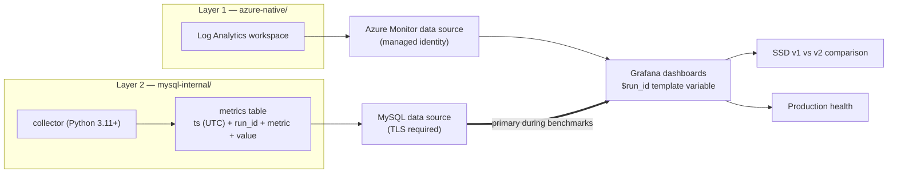

# grafana/ — Layer 3: unified visualisation

**Grafana is the final monitoring view.** It is the one place where Layer 1
([`../azure-native/`](../azure-native/)) and Layer 2 ([`../mysql-internal/`](../mysql-internal/))
are shown side by side — for Premium SSD v1 vs v2 benchmark comparison and for ongoing production
monitoring of gaming customers.

Grafana is a **presentation layer only**. It collects nothing; it reads what the other two layers
already produce.

## What lives here

| Directory | Purpose |
|---|---|
| [`dashboards/`](dashboards/) | Dashboard JSON models, committed and reviewed in PRs |
| [`datasources/`](datasources/) | Data source provisioning YAML (Azure Monitor + MySQL) |
| [`provisioning/`](provisioning/) | Dashboard providers, folders, and deployment wiring |

## Architecture



## Data sources

### 1. Azure Monitor — Layer 1

Reads platform metrics and Log Analytics logs. Reuses the queries in
[`../azure-native/kql/`](../azure-native/kql/); keep the two in sync.

On **Azure Managed Grafana**, authenticate with a **managed identity** so no client secret exists
anywhere. On self-hosted Grafana, use a workload identity or an app registration whose secret is
injected from a vault at runtime — never committed.

### 2. MySQL — Layer 2

Reads the collector's metrics table. This is the **primary source during benchmark runs**, because
Premium SSD v2 servers are in preview and Azure platform telemetry may be incomplete for them.

MySQL 8.4 requirements for this data source:

- Grafana's MySQL driver supports **`caching_sha2_password`**, which is the 8.4 default
  (`mysql_native_password` is disabled) — do not attempt to switch the user's plugin.
- Azure enforces `require_secure_transport=ON`, so the data source **TLS/SSL mode must be
  `require`** (or verify-ca with the Azure CA bundle). Never configure `skip-tls` / disabled.
- Point it at a **read-only** monitoring user.

## Important: Grafana needs a time series, not `SHOW GLOBAL STATUS`

Querying `SHOW GLOBAL STATUS` directly from Grafana returns an **instantaneous snapshot**, which
cannot be graphed over time. The collector must therefore persist samples, and Grafana reads the
persisted rows:

```sql
-- Grafana time-series query shape (MySQL data source)
SELECT
  ts        AS time,     -- DATETIME(3), stored in UTC
  metric    AS metric,
  value     AS value
FROM monitoring_metrics
WHERE run_id = '$run_id'
  AND $__timeFilter(ts)
ORDER BY ts;
```

Requirements this places on [`../mysql-internal/collector/`](../mysql-internal/collector/):

- A **MySQL sink** in addition to the JSON Lines file sink.
- `ts` stored in **UTC** (Grafana assumes UTC for MySQL `DATETIME` columns; a local-time column
  will shift every panel).
- `run_id` on **every** row, so the dashboard can filter one benchmark run.

## Dashboard conventions

- **`$run_id` is a template variable** on every benchmark dashboard, so a v1 run and a v2 run can
  be selected and compared without editing panels.
- Add a storage-tier variable (`premium-ssd-v1` / `premium-ssd-v2`) for labelling comparisons.
- All dashboard time handling stays **UTC ISO-8601**; do not set a fixed local timezone.
- Where a panel shows redo-log configuration, use `innodb_redo_log_capacity` — MySQL 8.4 removed
  `innodb_log_file_size`.
- Dashboards are **provisioned from this repo**, not edited-and-left in the UI. Export the JSON and
  commit it so changes are reviewable.

## Relationship to Azure Workbooks

[`../azure-native/workbooks/`](../azure-native/workbooks/) stays as the Azure-native, portal-side
view. **Grafana is the primary operator-facing dashboard** because it is the only layer that can
render Azure Monitor data and collector data on a single time axis.

## Configuration

Nothing is hardcoded — no credentials in dashboard JSON, no credentials in provisioning YAML.
Provisioning files reference environment variables, which Grafana expands at startup:

| Variable | Description |
|---|---|
| `MYSQL_HOST` | Flexible Server FQDN, used by the MySQL data source |
| `MYSQL_USER` | Read-only monitoring user |
| `MYSQL_PASSWORD` | Password — injected at runtime, never logged, never committed |
| `MYSQL_DB` | Database holding the collector's metrics table |
| `RUN_ID` | Benchmark run identifier; surfaced as the `$run_id` dashboard variable |
| `AZURE_SUBSCRIPTION_ID` | Subscription for the Azure Monitor data source |
| `LOG_ANALYTICS_WORKSPACE_ID` | Workspace queried by the Azure Monitor data source |

```bash
export MYSQL_HOST="<server>.mysql.database.azure.com"
export MYSQL_USER="<user>"
export MYSQL_PASSWORD="<password>"
export MYSQL_DB="<database>"
export RUN_ID="ssdv2-2026-08-10-01"
```
