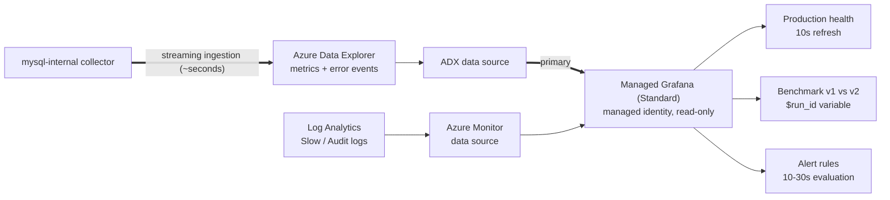

# grafana/ — the final monitoring view

**Azure Managed Grafana (Standard tier)** is the single operator-facing surface. It renders the
unified ADX store together with Azure Monitor telemetry on one time axis, for both Premium SSD
v1 vs v2 benchmarks and ongoing production monitoring of gaming customers.

Grafana is a **presentation and alerting layer only**. It collects and stores nothing.

## What lives here

| Directory | Purpose |
|---|---|
| [`dashboards/`](dashboards/) | Dashboard JSON models, committed and reviewed in PRs |
| [`datasources/`](datasources/) | ADX + Azure Monitor provisioning YAML |
| [`provisioning/`](provisioning/) | Dashboard providers, folders, and deployment wiring |

## Architecture

## Why ADX is the primary data source

| | ADX (Layer 2 store) | Azure Monitor (Layer 1) |
|---|---|---|
| Latency | Seconds (streaming ingestion) | 2–5 minutes |
| Premium SSD v2 preview coverage | Complete | May have gaps |
| MySQL error log | **Available** | Not offered at all |
| Slow / audit logs | Not collected here | `AzureDiagnostics` |
| Retention control | Per-table policies + rollups | Workspace retention |

Flexible Server's diagnostic settings expose only `MySQL Audit Logs` and `MySQL Slow Logs`, so the
error log reaches Grafana exclusively through ADX.

## Real-time budget

| Stage | Contribution |
|---|---|
| Collector poll interval (10s) | ~5s average |
| ADX streaming ingestion | ~5s |
| Grafana alert evaluation (30s) | ~15s |
| **End-to-end detection** | **~25–45s** |

To hold that budget: dashboard auto-refresh at **10s**, alert rule evaluation at **10–30s**, and
panels that query raw `MysqlMetrics` rather than the rollup views for short time ranges.

## Alerting tiers

Alerts are deliberately split so no single failure silences everything:

| Tier | Source | Evaluation | Covers |
|---|---|---|---|
| Fast | ADX via Grafana | 10–30s | Connection spikes, replica lag, deadlocks, `error_log` ERROR entries |
| Slow | Azure Monitor | 1–5 min | Storage full, CPU, host-level saturation — survives collector failure |
| **Heartbeat** | ADX via Grafana | 30s | **No `collector_heartbeat` for 60s** |

The heartbeat rule is not optional. With a self-built collector, a crash makes every chart flatline,
which reads as "healthy" unless absence of data is itself alertable.

## Dashboard conventions

- **`$run_id` is a template variable** on benchmark dashboards, so a v1 run and a v2 run can be
  compared without editing panels.
- Long time ranges query the **materialized rollup views**, not raw tables; short/live ranges query
  raw. See [`../adx/tables/`](../adx/tables/).
- Kusto `datetime` is always UTC, matching this repo's UTC ISO-8601 rule — never pin a dashboard to
  a local timezone.
- Counters from `SHOW GLOBAL STATUS` are cumulative; apply a delta/rate transform rather than
  plotting raw values.
- MySQL 8.4 only: redo-log panels use `innodb_redo_log_capacity`, not `innodb_log_file_size`.
- Dashboards are **provisioned from this repo**, never left as UI-only edits.

## Relationship to Azure Workbooks

[`../azure-native/workbooks/`](../azure-native/workbooks/) remains the Azure-native, portal-side
view for people already working in the Azure portal. Grafana is the primary operator dashboard
because it is the only surface that renders both layers together in near real time.

## Configuration

No credentials anywhere — both data sources authenticate with **managed identity**.

| Variable | Description |
|---|---|
| `ADX_CLUSTER_URI` | `https://<cluster>.<region>.kusto.windows.net` |
| `ADX_DATABASE` | Database holding `MysqlMetrics` / `MysqlEvents` |
| `AZURE_SUBSCRIPTION_ID` | Subscription for the Azure Monitor data source |
| `LOG_ANALYTICS_WORKSPACE_ID` | Workspace receiving Slow/Audit logs |
| `RUN_ID` | Benchmark run identifier, surfaced as the `$run_id` variable |

MySQL credentials (`MYSQL_HOST`, `MYSQL_USER`, `MYSQL_PASSWORD`, `MYSQL_DB`) are **not** used by
this layer; they belong to [`../mysql-internal/collector/`](../mysql-internal/collector/).
