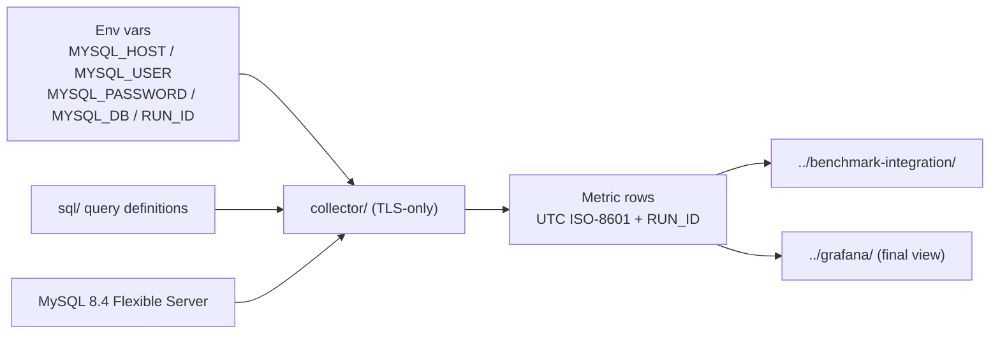

# mysql-internal/ — Layer 2: in-server telemetry

Telemetry collected by connecting **directly to MySQL 8.4** on Azure Database for MySQL Flexible
Server, independent of Azure Monitor.

## What lives here

| Directory | Purpose |
|---|---|
| [`collector/`](collector/) | Python 3.11+ collector that polls the server on an interval |
| [`sql/`](sql/) | `SHOW GLOBAL STATUS` and `performance_schema` query definitions |

## Why this layer is primary during benchmarks

**Premium SSD v2 servers are in preview**, so Azure platform metrics and diagnostic logs may be
incomplete for them. Layer 2 talks to the engine directly, so it produces a consistent dataset for
both Premium SSD v1 and v2. When Layer 1 and Layer 2 disagree during a benchmark run, Layer 2 wins
and the discrepancy is recorded.

## Data flow



## MySQL 8.4 requirements

- `caching_sha2_password` is the default auth plugin; `mysql_native_password` is **disabled by
  default**. The driver must support `caching_sha2_password`.
- `innodb_redo_log_capacity` replaces `innodb_log_file_size` — query and report the new variable.
- Azure enforces `require_secure_transport=ON`, so **the connection must use SSL/TLS**. A
  non-TLS connection will be rejected by the server, and this repo never disables TLS.

## Configuration

Nothing is hardcoded. All connection info comes from environment variables:

| Variable | Description |
|---|---|
| `MYSQL_HOST` | Flexible Server FQDN, e.g. `<name>.mysql.database.azure.com` |
| `MYSQL_USER` | MySQL user with `SELECT` on `performance_schema` and `PROCESS` |
| `MYSQL_PASSWORD` | Password (never logged, never committed) |
| `MYSQL_DB` | Default database/schema |
| `RUN_ID` | Tagged onto every emitted metric row |

## Conventions

- **Python 3.11+**, dependencies limited to `mysql-connector-python` (or `PyMySQL`). **No ORM.**
- **All timestamps are UTC ISO-8601.**
- **Every metric row carries `RUN_ID`**, so collector output joins with benchmark results on the
  time axis.

## Required grants

```sql
-- Read-only monitoring user (8.4: caching_sha2_password is the default plugin)
CREATE USER 'monitor'@'%' IDENTIFIED BY '<supplied-at-runtime>';
GRANT PROCESS, REPLICATION CLIENT ON *.* TO 'monitor'@'%';
GRANT SELECT ON performance_schema.* TO 'monitor'@'%';
```

Create this user out-of-band; never commit a real password.
